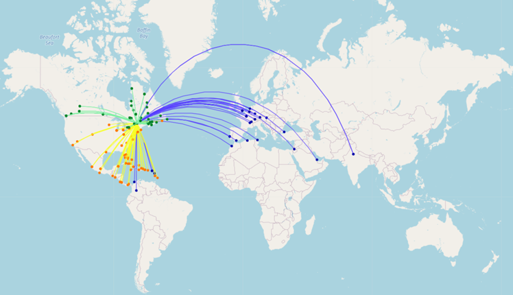

# LifRadarAvion
***
Bienvenue au sein de notre projet LifRadarAvion réalisé en 2022.  

## Présentation
Le projet **LifRadarAvion** est réalisé dans le cadre de l'UE LIFPROJET de l'université 
Claude Bernard Lyon 1. Composé de deux étudiants, **DE JONG Anne** et **MERCIER Loris**, le
projet a pour but d'**analyser les données liées au trafic aérien mondiale**.

Avec plus de 36 millions de vols annuels à travers le monde, le transport aérien
est riche en données et nous permet de l'analyser sous 3 grands axes :  
&nbsp;&nbsp;&nbsp; ✈&nbsp;&nbsp; **Une analyse géographique** (avec représentation sous forme de carte)  
&nbsp;&nbsp;&nbsp; ✈&nbsp;&nbsp; **Une analyse statistique** (avec représentation sous forme de graphique)  
&nbsp;&nbsp;&nbsp; ✈&nbsp;&nbsp; **Des calculs d'itinéraires** (en utilisant les parcours de graphes) 

___
Notre site web : [LifRadarAvion](https://radaravion.runmercury.com/)  
Nos Notebooks en Local : [Notebook_Web](./Notebook_Web)




## Table des matières
1. [Execution en ligne via Mercury](#execution-en-ligne-via-mercury)
2. [Execution local via Mercury](#execution-local-via-mercury)
3. [Execution standard du Notebook](#execution-standard-du-notebook)
4. [Réalisation](#réalisation)

## Execution en ligne via Mercury
Découvrer notre notebook en ligne en suivant le lien ci-dessous :  

[LifRadarAvion Online ](https://radaravion.runmercury.com/)

Ce site est créé à partir du Framework Mercury.   
Les notebooks sont disponible dans le dossier _./Notebook_Web.

## Execution local via Mercury
En cas de latence trop longue en ligne, vous pouvez executer notre application en local. Les temps de chargement seront alors bien plus rapide.

- Tétélacharger le dossier **```Notebook_Web```**
- Installer les bibliothèques présentes dans ```_requirements.txt_``` dont Mercury

Saisissez ensuite la ligne de commande suivante à la racine du projet :

```bash
mercury run
```
Une page web s'ouvre alors dans votre navigateur.


## Execution standard du Notebook
- Installer les bibliothèques présentes dans _requirements.txt_
- Ouvrer les notebooks présents dans **```Notebook_Web```**
- Selectionner le kernel
- Executer l'ensemble des cellules (Run all)

L'application est désormais opérationnelle

### Fonctionnement
Utilisez les widgets disponibles afin d'afficher vos cartes/graphiques souhaités.  
En cas de widgets defectueux, décommenter la cellule précédent le widget puis lancer l'execution de cette dernière.  

> Le fichier Creation_csv.ipynb est le script nous ayant permis de constituer nos fichiers csv présent dans _./data_. Il n'a pas vocation à être exécuté de nouveau.

## Réalisation
Retrouver toutes nos démarches dans notre [rapport de projet](Rapport_de_projet_ANLO.pdf)  

En bref :
- Collecte des données aériennes via l'API de _FlightRadar24_
    - Mise en place d'un script python déployé sur un serveur pour assurer la collecte des données sur un espace d'un mois (Février 2022)
- Collecte des données géographiques depuis _REST Countries API_
- Nettoyage, harmonisation et consolidation des données via le fichier [Creation_csv.ipynb](./Creation_csv.ipynb)
- Analyse des données via le fichier [notebook_ANLO.ipynb](./notebook_ANLO.ipynb)
- Visualisation de données via les notebooks présents dans **[notebook_Web](./notebook_Web)**
    - Création d'un site web via le Framework Mercury
